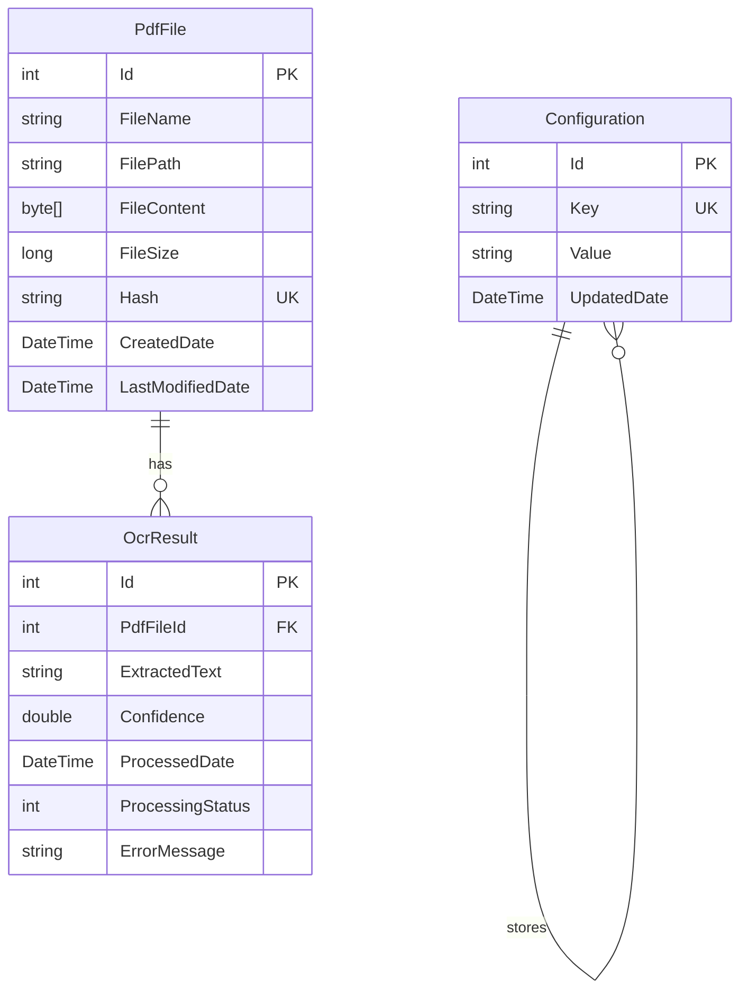

# Dokumentacja Systemu PDF OCR

## 1. Założenia Systemu

System PDF OCR jest aplikacją webową służącą do:
- Automatycznego skanowania wskazanego katalogu w poszukiwaniu plików PDF
- Zapisywania plików PDF do bazy danych z deduplikacją (na podstawie hash SHA256)
- Automatycznego wykonywania OCR (Optical Character Recognition) na plikach PDF przy użyciu biblioteki Tesseract
- Przechowywania wyników OCR w bazie danych
- Udostępniania interfejsu użytkownika do:
  - Konfiguracji katalogu skanowania
  - Przeglądania listy plików PDF
  - Podglądu plików PDF
  - Przeglądania tekstu wyekstrahowanego z plików PDF

## 2. Aktorzy

### 2.1 Użytkownik Końcowy
- **Opis**: Osoba korzystająca z aplikacji do zarządzania plikami PDF i przeglądania wyników OCR
- **Uprawnienia**:
  - Konfiguracja katalogu skanowania
  - Uruchamianie skanowania katalogu
  - Przeglądanie listy plików PDF
  - Podgląd plików PDF
  - Przeglądanie tekstu wyekstrahowanego z OCR
  - Ręczne uruchamianie procesu OCR dla wybranego pliku

## 3. Przepływ Informacji

### 3.1 Konfiguracja Katalogu Skanowania

```
Użytkownik → Frontend (ConfigurationPage) → API (ConfigurationController) → 
ConfigurationService → Database (Configurations table)
```

### 3.2 Skanowanie Katalogu

```
Użytkownik → Frontend (FilesListPage) → API (FilesController/Scan) → 
FileScannerService → FileSystem → 
PdfStorageService → Database (PdfFiles table) → 
OcrQueueService → Background Service (OcrProcessingService)
```

### 3.3 Przetwarzanie OCR

```
Background Service (OcrProcessingService) → OcrService → 
Tesseract OCR Engine → OcrService → 
Database (OcrResults table)
```

### 3.4 Przeglądanie Plików

```
Użytkownik → Frontend (FilesListPage) → API (FilesController/GetFiles) → 
PdfStorageService → Database → Frontend
```

### 3.5 Podgląd PDF

```
Użytkownik → Frontend (FileDetailsPage) → API (FilesController/GetPdf) → 
PdfStorageService → Database → Frontend (PdfViewer component)
```

### 3.6 Przeglądanie Wyników OCR

```
Użytkownik → Frontend (FileDetailsPage) → API (FilesController/GetOcr) → 
PdfStorageService → Database → Frontend (OcrTextViewer component)
```

## 4. Model Danych

### 4.1 Encje

#### PdfFile
- **Id** (int, PK): Unikalny identyfikator pliku
- **FileName** (string, max 500): Nazwa pliku PDF
- **FilePath** (string, max 1000): Ścieżka do pliku w systemie plików
- **FileContent** (byte[]): Zawartość pliku PDF jako BLOB
- **FileSize** (long): Rozmiar pliku w bajtach
- **Hash** (string, max 64, unique): Hash SHA256 pliku (dla deduplikacji)
- **CreatedDate** (DateTime): Data utworzenia rekordu
- **LastModifiedDate** (DateTime): Data ostatniej modyfikacji rekordu
- **OcrResults** (ICollection<OcrResult>): Relacja jeden-do-wielu z wynikami OCR

#### OcrResult
- **Id** (int, PK): Unikalny identyfikator wyniku OCR
- **PdfFileId** (int, FK): Identyfikator powiązanego pliku PDF
- **ExtractedText** (string): Tekst wyekstrahowany z pliku PDF
- **Confidence** (double?, nullable): Poziom pewności OCR (0.0 - 1.0)
- **ProcessedDate** (DateTime): Data przetworzenia OCR
- **ProcessingStatus** (ProcessingStatus enum): Status przetwarzania
  - Pending: Oczekuje na przetworzenie
  - Processing: W trakcie przetwarzania
  - Completed: Zakończone pomyślnie
  - Failed: Niepowodzenie
- **ErrorMessage** (string?, nullable): Komunikat błędu w przypadku niepowodzenia
- **PdfFile** (PdfFile): Relacja wiele-do-jednego z plikiem PDF

#### Configuration
- **Id** (int, PK): Unikalny identyfikator konfiguracji
- **Key** (string, max 100, unique): Klucz konfiguracji
- **Value** (string, max 2000): Wartość konfiguracji
- **UpdatedDate** (DateTime): Data ostatniej aktualizacji

### 4.2 Relacje

- **PdfFile ↔ OcrResult**: Relacja jeden-do-wielu (jeden plik PDF może mieć wiele wyników OCR, ale w praktyce jeden aktywny)
- **Cascade Delete**: Usunięcie pliku PDF powoduje usunięcie powiązanych wyników OCR

## 5. Diagram ERD



## 6. Architektura Techniczna

### 6.1 Backend
- **Framework**: ASP.NET Core 8.0
- **Baza danych**: SQL Server (lokalna w dev, Azure SQL w prod)
- **ORM**: Entity Framework Core 8.0
- **OCR**: Tesseract.NET 5.2.0
- **Architektura**: Clean Architecture (Core, Application, Infrastructure, API)

### 6.2 Frontend
- **Framework**: React 18+ z TypeScript
- **Routing**: React Router DOM
- **UI**: Material-UI (MUI)
- **HTTP Client**: Axios
- **PDF Viewer**: react-pdf

### 6.3 Środowiska
- **Development**: Lokalne środowisko deweloperskie
- **Test**: Środowisko testowe pod IIS
- **Production**: Azure Web App + Azure SQL Database

## 7. Bezpieczeństwo

- Wszystkie wrażliwe dane (connection strings, klucze API) przechowywane w zmiennych środowiskowych / App Settings
- CORS skonfigurowany dla określonych domen
- Walidacja danych wejściowych na poziomie API
- Defensywne migracje bazy danych (sprawdzanie istnienia obiektów)

## 8. Wydajność

- Indeksy na kolumnach Hash i FileName dla szybkiego wyszukiwania
- Paginacja wyników listy plików
- Przetwarzanie OCR w tle (background service)
- Kolejka zadań OCR dla równoległego przetwarzania

## 9. Logowanie

- Wszystkie operacje logowane przy użyciu ILogger
- Poziomy logowania:
  - Development: Information
  - Test: Information
  - Production: Warning

## 10. Testy

- Testy jednostkowe dla serwisów (FileScannerService, OcrService, PdfStorageService)
- Testy integracyjne dla API endpoints
- Testy komponentów React
